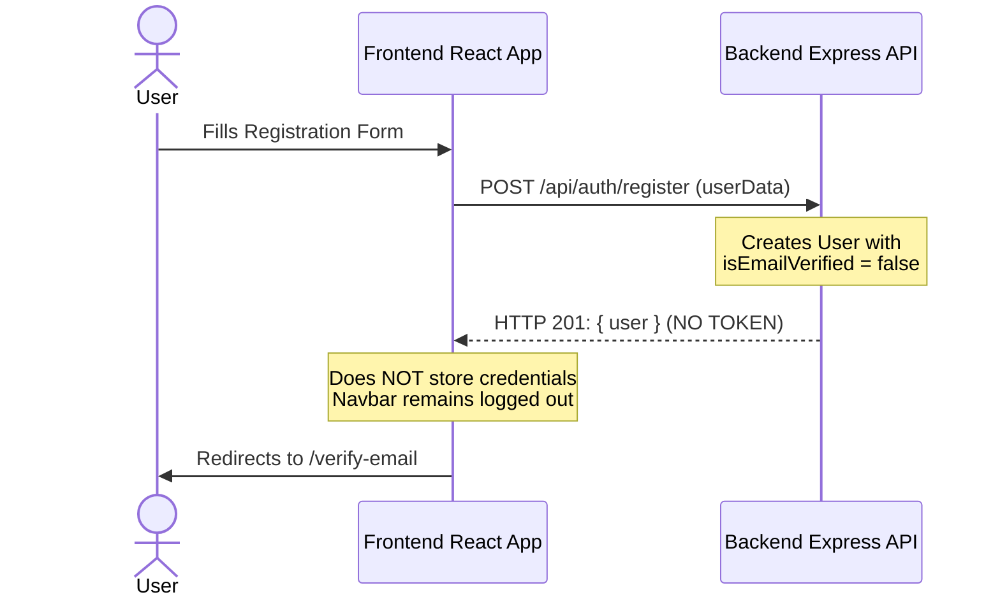

# Security Audit & Remediation Report: Email Verification Bypass

## 1. Executive Summary
During testing of the user registration and onboarding flow, a critical security vulnerability was identified where newly registered users were granted full access to protected dashboard features and resources before verifying their email address. This allowed users to bypass the mandatory email verification step, potentially compromising the system's data privacy and session integrity.

This report details the vulnerability's scope, root causes, security implications, and the implemented solution spanning both the frontend and backend layers.

---

## 2. Vulnerability Description
When a user filled out the registration form and submitted their information, they were redirected to the `/verify-email` screen (as intended). However, the main navigation header (Navbar) immediately transitioned to an authenticated state, displaying tabs like **Dashboard** and **Report**. 

Clicking any of these tabs allowed the user to bypass email verification and access protected routes. Furthermore, refreshing the page or navigating back to the app preserved this logged-in state.

---

## 3. Scope & Root Cause Analysis

### A. Frontend Session Persistence on Registration
- **Affected File**: [authService.js](file:///c:/Omars_final_Project/thyroCare/FrontEndLayer/final_project/src/services/authService.js)
- **Root Cause**: Upon receiving a successful registration response, the frontend `register` service immediately stored the returned token and user object in the browser's `localStorage` (`userToken` and `user`).
- **Affected File**: [UserContext.jsx](file:///c:/Omars_final_Project/thyroCare/FrontEndLayer/final_project/src/context/UserContext.jsx)
- **Root Cause**: The React context handler `handleRegister` immediately updated the global states `userToken` and `user` using the return values of `register(...)`. Because the global authentication state became populated, the UI rendered navigation links reserved for verified, logged-in users.

### B. Backend JWT Token Generation on Registration
- **Affected File**: [auth.controller.js](file:///c:/Omars_final_Project/thyroCare/BackEndLayer/src/controllers/auth.controller.js)
- **Root Cause**: In the `register` controller, after creating the user record, the backend generated a JSON Web Token (JWT) using `jwt.sign(...)` and sent it back in the response body. This gave the frontend a valid authentication token prior to the user proving email ownership.

### C. Backend Authentication Middleware Gap
- **Affected File**: [auth.middleware.js](file:///c:/Omars_final_Project/thyroCare/BackEndLayer/src/middlewares/auth.middleware.js)
- **Root Cause**: The JWT verification middleware (`auth`) checked if the token was valid and if the user existed in the database, but it did **not** inspect the `user.isEmailVerified` boolean flag. This meant any user holding a token—even an unverified one—could access all authenticated API endpoints (such as fetching reports, updating profiles, and generating predictions).

---

## 4. Security Implications
1. **Bypassing Access Controls**: Unverified users could access user profiles, upload and view lab reports, interact with the AI assistant, and perform diagnosis predictions.
2. **Account Harvesting & Spam**: Spammers or malicious actors could register using fake or invalid email addresses and immediately utilize backend features (e.g. LLM tokens, database storage) without validating their identity.
3. **Data Integrity Risks**: The system could be flooded with stale, unverified profiles possessing active, functional data records.

---

## 5. Remediations & Technical Fixes

A coordinated solution was implemented in both the frontend and backend layers to completely close this bypass vector:



### 1. Backend Changes
#### A. Disable JWT Token Generation on Registration
In [auth.controller.js](file:///c:/Omars_final_Project/thyroCare/BackEndLayer/src/controllers/auth.controller.js), the code responsible for signing and returning the JWT token in `register` was removed:
```diff
-  const token = jwt.sign({ id: user._id }, process.env.JWT_SECRET, {
-    expiresIn: process.env.JWT_EXPIRES_IN,
-  });
-
-  respond(res, 201, { user, token }, "Registered successfully. Please check your email to verify your account.");
+  respond(res, 201, { user }, "Registered successfully. Please check your email to verify your account.");
```

#### B. Enforce Verification status in Authentication Middleware
In [auth.middleware.js](file:///c:/Omars_final_Project/thyroCare/BackEndLayer/src/middlewares/auth.middleware.js), a strict check was added to block unverified users from calling protected APIs:
```diff
     const user = await User.findById(decoded.id);
     if (!user) {
       return respond(res, 401, null, "User no longer exists");
     }
 
+    if (!user.isEmailVerified) {
+      return respond(res, 403, null, "Please verify your email address first");
+    }
+
     req.user = { id: user._id, role: user.role };
     next();
```

---

### 2. Frontend Changes
#### A. Prevent Registration from Activating Browser Storage Session
In [authService.js](file:///c:/Omars_final_Project/thyroCare/FrontEndLayer/final_project/src/services/authService.js), the lines setting the user and token to `localStorage` during registration were removed:
```diff
-    const token = data.token || data.userToken || data.accessToken || data.access_token || (data.data && (data.data.token || data.data.userToken || data.data.accessToken));
     const user = data.user || data.data?.user || data;
 
-    localStorage.setItem("userToken", token || "");
-    localStorage.setItem("user", JSON.stringify(user));
     toast.success("Account created successfully!", { id: toastId });
-    return { token, user };
+    return { user };
```

#### B. Prevent Context State Update on Registration
In [UserContext.jsx](file:///c:/Omars_final_Project/thyroCare/FrontEndLayer/final_project/src/context/UserContext.jsx), the registration callback `handleRegister` was updated to avoid logging the user in globally:
```diff
   const handleRegister = useCallback(
     async (userData) => {
       console.log("[UserContext] Attempting registration...");
-      const { token, user } = await register(userData);
-      console.log("[UserContext] Registration successful. Updating state...");
-      setuserToken(token);
-      setuser(user);
-      return { token, user };
+      const { user } = await register(userData);
+      console.log("[UserContext] Registration successful. Not setting login state (email verification required).");
+      return { user };
     },
-    [setuser, setuserToken]
+    []
   );
```

---

## 6. Verification Results
1. **On Registration Submission**: The user registers successfully. The frontend does not save a token or user to storage. 
2. **UI Navigation Restriction**: The Navbar correctly remains in the "Guest" state (showing only the Home and About Us links, and displaying Log in / Sign up buttons). 
3. **Route Protection**: If the user tries to manually navigate to `/dashboard` or `/profile` before verification, they are immediately redirected to `/login` by the `ProtectedRoute`.
4. **Backend Security**: Any attempts to access protected endpoints using an unverified account session return `403 Forbidden: Please verify your email address first`.
